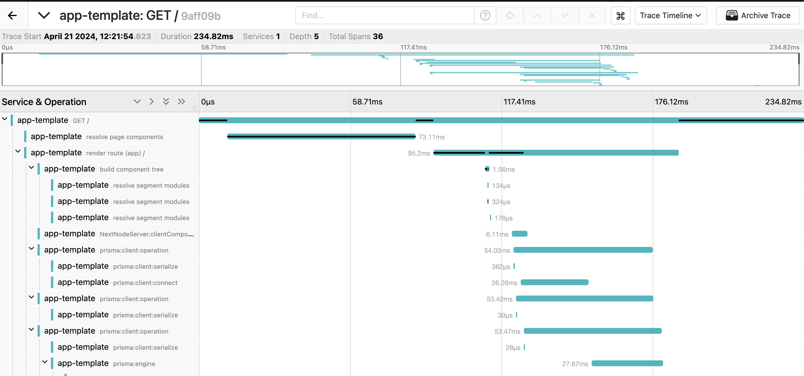

<!-- 👉 remove -->

<div align="center">
  <strong>️️A minimal template for web app 🎃</strong>
</div>

<br />
<br />

This template is based on create-next-app but has below new tech and configs.

| Kind        |                           |                         |                               |
| ----------- | ------------------------- | ----------------------- | ----------------------------- |
| **App**     | Next.js (Framework)       | Tailwind CSS (CSS)      |                               |
|             | React Hook Form (Form)    | Zod (Schema Validator)  |                               |
|             | Prisma (ORM)              | NextAuth.js (Auth)      | OpenTelemetry (Observability) |
|             |                           |                         |                               |
| **Tools**   | TypeScript (Language)     | pnpm (Package Manager)  | NVM (Node Version manager)    |
|             | Biome (Linter, Formatter) | Prettier (Formatter)    |                               |
|             | lint-staged (Pre Commit)  | Docker Compose (Docker) |                               |
|             |                           |                         |                               |
| **Testing** | Vitest (Test Runner)      | Testing Library (React) | Playwright (E2E Testing)      |
|             |                           |                         |                               |
| **Others**  | GitHub Workflows (CI)     | Renovate (Deps Manager) | .vscode (Editor)              |

Just running create-next-app does not satisfy the dependencies, development environment, and CI environment to create a web application. In addition, many dependencies require setting configs for example, `@next-auth/prisma-adapter` requires adding many schemas to `schema.prisma` but we don't know what we add so always need to check the docs every time. This project is created as a template with minimal code in advance so that you can focus on development.

## 🐕 What does this project support?

<details>
  <summary>Next.js</summary>

- introducing parallel route and intercepting route
- introducing server actions using Zod
- setting common files like robots, opengraph-image, etc
- supporting Docker
- supporting observability using OpenTelemetry

</details>

<details>
  <summary>Prisma</summary>

- introducing dev/test env using Docker Compose and PostgreSQL
- fixing [well-known Next.js issue](https://www.prisma.io/docs/orm/more/help-and-troubleshooting/help-articles/nextjs-prisma-client-dev-practices)
- generating ERD automatically
- running migration on github actions

</details>

<details>
  <summary>NextAuth.js</summary>

- introducing Google Oauth provider
- defining [Prisma schema](https://authjs.dev/reference/adapter/prisma#create-the-prisma-schema-from-scratch) and connecting database
- setting Next.js api route using app router

</details>

<details>
  <summary>Biome, Prettier</summary>
  
  - introducing how to control these when pre-commit
  - assigning Prisma, Biome, Prettier to each language for vscode
</details>

<details>
  <summary>Playwright</summary>

- introducing [Page object models](https://playwright.dev/docs/pom) for e2e to make it resistant to change code
- introducing how to avoid OAuth Providers with NextAuth.js

</details>

<details>
  <summary>CI</summary>

- CI tasks: lint, build, unit test, e2e test
- Prod tasks: migrating DB when main branch

</details>

## Install

### GitHub Template

This repo is a github template so click the ["Use this template"](https://github.com/new?template_owner=hiroppy&template_name=web-app-template) button and you will create your repo.

### CLI

[`create-app-foundation`](https://github.com/hiroppy/create-app-foundation) creates a directory based on this template and skips the setup section automatically.

```sh
npx create-app-foundation
```

<!-- ######## -->

## Setup

**1. Installing Docker Compose**

Please check [Installation scenarios](https://docs.docker.com/compose/install/) section.

**2. Enabling git hook and corepack**

```sh
npm run setup
```

**3. Installing Deps**

```sh
pnpm i
```

**4. Creating `.env.local` and modifying environment variables**

```sh
cp .env.sample .env.local
```

Set the following environment variables in `.env.local`.

```
GOOGLE_CLIENT_ID=
GOOGLE_CLIENT_SECRET=
```

_If you don't use Google OAuth, you can remove a provider from `_clients/NextAuth.ts`._

<!-- 👉 remove -->

**5. Running init.mjs**

- generating DB migration files
- removing unnecessary code
- updating name in package.json using directory name

```sh
node init.mjs
```

<!-- ######## -->

## Dev

```sh
# start docker-compose, migrations(generating the client), and next dev
pnpm dev
# create new migration
pnpm dev:db:migrate
# reset the DB
pnpm dev:db:reset
# view the contents
pnpm dev:db:studio
```

📙 [Database ER diagram](/prisma/ERD.md)

## Test

Test uses also DB so need to start DB first.

```sh
# unit test

# run the DB and generate the client
pnpm test:db:setup
# execute
pnpm test
# watch the unit test
pnpm test:watch
# reset the DB
pnpm test:db:reset

# e2e

# install chrome
pnpm exec playwright install chrome
# run the DB and generate the client
pnpm test:db:setup
# test uses a built app since next.js has different cache behavior between development and production
pnpm build
# execute
pnpm test:e2e
```

💁‍♀️ This template recommends using a real database but when you face not keeping idempotency, you might consider using mock.

## Prod

```sh
pnpm db:start
pnpm build
pnpm start
```

If you set `POSTGRESQL_URL` as GitHub secrets, you will be able to execute migration for database on GitHub actions(`.github/workflows/migration.yml`).

## Observability

This project has [OpenTelemetry](https://opentelemetry.io/) and it works only production environment.

### Local

```sh
pnpm db:start
pnpm build
pnpm start
# open Jaeger
open http://localhost:16686/
```

<!-- 👉 remove -->



<!-- ######## -->

### Server

Please add a url to `process.env.TRACE_EXPORTER_URL`.
