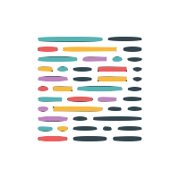
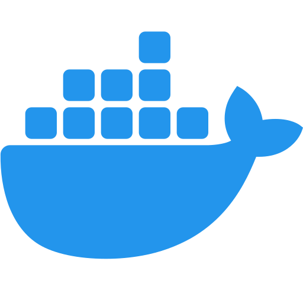
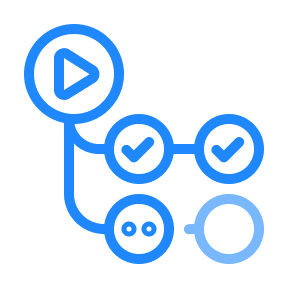

<!-- 👉 remove -->

<div align="center">
  <h1>️️A minimal template for web app 🎃</h1>
  
  <p>From Zero to Service, Build with Best Practices, Minimal Code, and Essential Tools</p>
  <br />
  <a href="https://hiroppy.github.io/web-app-template/"target="_blank" >📜 Read The Docs 📜</a>
  <br />
  <br />
</div>

Installing this template automatically sets up the following libraries/tools. By saving you significant effort, it allows you to focus entirely on writing your product code.🤗

|             |                                                                                                                                              |                                                                                                                                                      |                                                                                                                                       |                                                                                                                                                     |
| ----------- | -------------------------------------------------------------------------------------------------------------------------------------------- | ---------------------------------------------------------------------------------------------------------------------------------------------------- | ------------------------------------------------------------------------------------------------------------------------------------- | --------------------------------------------------------------------------------------------------------------------------------------------------- |
| **App**     | <div align="center"><br>Next.js</div>                    | <div align="center"><br>Tailwind CSS</div>                   | <div align="center"><br>NextAuth.js</div>   | <div align="center"><br>React Hook Form</div> |
|             | <div align="center"><br>Zod </div>                             | <div align="center"><br>OpenTelemetry </div>                         | <div align="center"><br>Prisma </div>             | <div align="center"><br>PostgreSQL</div>                    |
|             |                                                                                                                                              |                                                                                                                                                      |                                                                                                                                       |
| **Tools**   | <div align="center"><br>TypeScript</div>         | <div align="center"><br>pnpm</div>                                   | <div align="center"><br>Biome </div>                | <div align="center"><br> Prettier</div>                     |
|             | <div align="center"><br> EditorConfig </div> | <div align="center"><br> lefthook</div>                      | <div align="center"><br> Docker </div>            |                                                                                                                                                     |
|             |                                                                                                                                              |                                                                                                                                                      |                                                                                                                                       |
| **Testing** | <div align="center"><br> Vitest</div>                    | <div align="center"><br> Testing Library</div> | <div align="center"><br> Playwright</div> | <div align="center"><br> Testcontainers</div>   |
|             |                                                                                                                                              |                                                                                                                                                      |
| **Others**  | <div align="center"><br> GitHub Actions</div>   | <div align="center"><br> Renovate</div>                      | <div align="center"><br> VSCode</div>             | <div align="center"><br> Copilot Edits</div>            |

## Prerequisites

- Node.js v20 or higher
- [Docker](https://docs.docker.com/engine/install/)

## Installation

When installing the repository, you can skip the setup section, as the init script will do the equivalent of setup.

### Using CLI (recommended)

```sh
$ npx create-app-foundation@latest
```

The CLI creates a project directory and run internal/init script so it's easy to get started.

### Using GitHub Template

This repo is a GitHub template, so click the ["Use this template"](https://github.com/new?template_owner=hiroppy&template_name=web-app-template) button to create your repo. Then, you need to execute the below to finish setting it up.

```sh
$ node .internal/setup/init.mjs
```

### Opt-out

The following items will be asked whether they are required when the project is initialized:

- Sample Application Code
- Dockerfile
- E2E Testing
- Observability feature

<!-- ######## -->

## Setup

```sh
# enable corepack
$ npm run setup
# install deps
$ pnpm i
# create ".env" and modifying environment variables
$ cp .env.sample .env
```

## Development

```sh
$ pnpm dev
```

## Production

```sh
$ pnpm db:up
$ pnpm build
$ pnpm start
```

<!-- start: otel -->

### Observability

This template uses Jaeger as a tracing platform. The local environment doesn't require `TRACE_EXPORTER_URL` environment value.

```sh
# open Jaeger
$ open http://localhost:16686/
```

<!-- end: otel -->

## Test

### Unit Test

```sh
$ pnpm test
$ pnpm test:watch
```

<!-- start: e2e -->

### E2E Test

A build task must be executed before running tests to bypass JWT logic.

```sh
# install chrome
$ pnpm exec playwright install chrome
# build using test environments since it needs to change encode/decode functions of next-auth
$ pnpm build:test

$ pnpm test:e2e
$ pnpm test:e2e:ui
```

<!-- end: e2e -->

## Database

```sh
$ pnpm db:migrate
$ pnpm db:reset
# view the database items
$ pnpm db:studio
```

## Links

- [Database ER diagram](/prisma/ERD.md)
- [Web App Template](https://hiroppy.github.io/web-app-template/)
