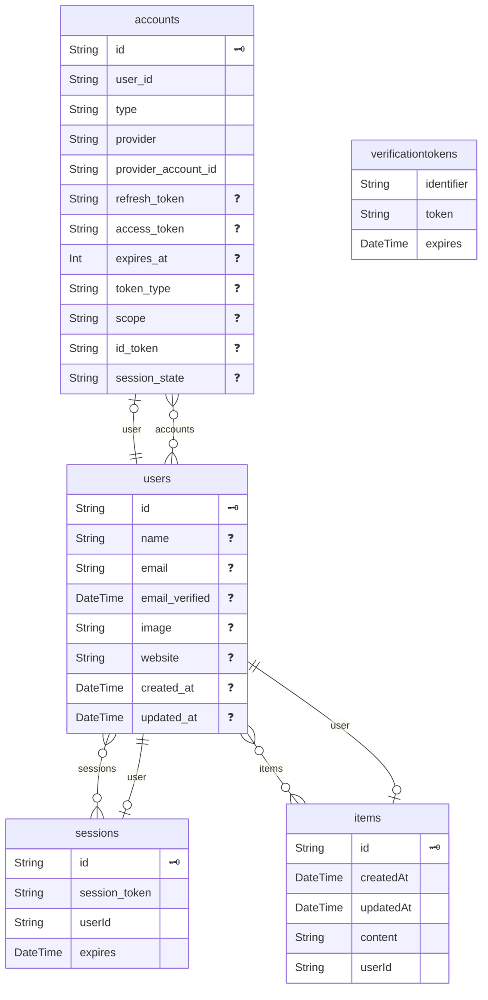

```mermaid
erDiagram

  "accounts" {
    String id "🗝️"
    String user_id 
    String type 
    String provider 
    String provider_account_id 
    String refresh_token "❓"
    String access_token "❓"
    Int expires_at "❓"
    String token_type "❓"
    String scope "❓"
    String id_token "❓"
    String session_state "❓"
    }
  

  "sessions" {
    String id "🗝️"
    String session_token 
    String userId 
    DateTime expires 
    }
  

  "users" {
    String id "🗝️"
    String name "❓"
    String email "❓"
    DateTime email_verified "❓"
    String image "❓"
    String website "❓"
    DateTime created_at "❓"
    DateTime updated_at "❓"
    }
  

  "verificationtokens" {
    String identifier 
    String token 
    DateTime expires 
    }
  

  "items" {
    String id "🗝️"
    DateTime createdAt 
    DateTime updatedAt 
    String content 
    String userId 
    }
  
    "accounts" o|--|| "users" : "user"
    "sessions" o|--|| "users" : "user"
    "users" o{--}o "accounts" : "accounts"
    "users" o{--}o "sessions" : "sessions"
    "users" o{--}o "items" : "items"
    "items" o|--|| "users" : "user"
```
