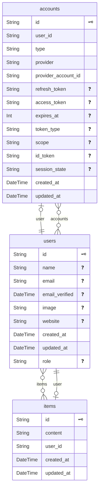

```mermaid
erDiagram

  "accounts" {
    String id "🗝️"
    String user_id
    String type
    String provider
    String provider_account_id
    String refresh_token "❓"
    String access_token "❓"
    Int expires_at "❓"
    String token_type "❓"
    String scope "❓"
    String id_token "❓"
    String session_state "❓"
    DateTime created_at
    DateTime updated_at
    }


  "users" {
    String id "🗝️"
    String name "❓"
    String email "❓"
    DateTime email_verified "❓"
    String image "❓"
    String website "❓"
    DateTime created_at
    DateTime updated_at
    String role "❓"
    }


  "items" {
    String id "🗝️"
    String content
    String user_id
    DateTime created_at
    DateTime updated_at
    }

    "accounts" o|--|| "users" : "user"
    "users" o{--}o "accounts" : "accounts"
    "users" o{--}o "items" : "items"
    "items" o|--|| "users" : "user"
```
