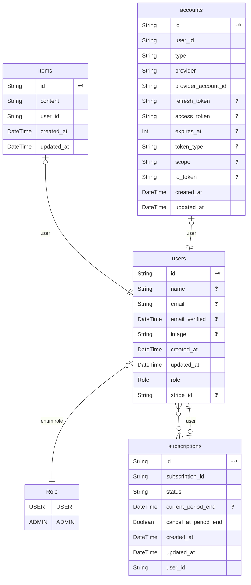

```mermaid
erDiagram

        Role {
            USER USER
ADMIN ADMIN
        }

  "items" {
    String id "🗝️"
    String content
    String user_id
    DateTime created_at
    DateTime updated_at
    }


  "accounts" {
    String id "🗝️"
    String user_id
    String type
    String provider
    String provider_account_id
    String refresh_token "❓"
    String access_token "❓"
    Int expires_at "❓"
    String token_type "❓"
    String scope "❓"
    String id_token "❓"
    DateTime created_at
    DateTime updated_at
    }


  "users" {
    String id "🗝️"
    String name "❓"
    String email "❓"
    DateTime email_verified "❓"
    String image "❓"
    DateTime created_at
    DateTime updated_at
    Role role
    String stripe_id "❓"
    }


  "subscriptions" {
    String id "🗝️"
    String subscription_id
    String status
    DateTime current_period_end "❓"
    Boolean cancel_at_period_end
    DateTime created_at
    DateTime updated_at
    String user_id
    }

    "items" o|--|| "users" : "user"
    "accounts" o|--|| "users" : "user"
    "users" o|--|| "Role" : "enum:role"
    "users" o{--}o "subscriptions" : ""
    "subscriptions" o|--|| "users" : "user"
```
